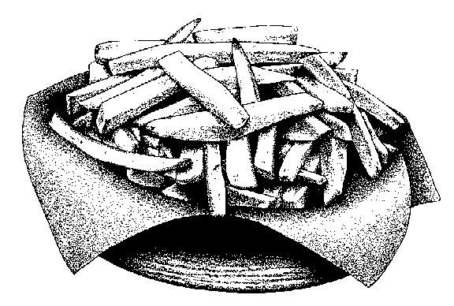

# Project: Restaurant Page
In this project, as a way of practicing DOM manipulation, i dynamically render a simple restaurant homepage using JavaScript alone to generate the entire contents of the website!

<!--
*** Thanks for checking out this README Template. If you have a suggestion that would
*** make this better, please fork the repo and create a pull request or simply open
*** an issue with the tag "enhancement".
*** Thanks again! Now go create something AMAZING! :D
-->

<!-- PROJECT SHIELDS -->
<!--
*** I'm using markdown "reference style" links for readability.
*** Reference links are enclosed in brackets [ ] instead of parentheses ( ).
*** See the bottom of this document for the declaration of the reference variables
*** for contributors-url, forks-url, etc. This is an optional, concise syntax you may use.
*** https://www.markdownguide.org/basic-syntax/#reference-style-links
-->
[![Contributors][contributors-shield]][contributors-url]
[![Forks][forks-shield]][forks-url]
[![Stargazers][stars-shield]][stars-url]
[![Issues][issues-shield]][issues-url]

<!-- PROJECT LOGO -->
<br />
<p align="center">
  <a href="https://github.com/PhillipUg/restaurant-page">
    
  </a>

  <h1 align="center">Restaurant Page</h1>

  <p align="center">
    This project is part of the Microverse curriculum and is done as an exercise in the Javascript section.
    <br />
    <br />
    <a href="https://rawcdn.githack.com/PhillipUg/restaurant-page/tree/restaurant-feature">View Demo</a>
    ·
    <a href="https://github.com/PhillipUg/restaurant-page/issues">Report Bug</a>
    ·
    <a href="https://github.com/PhillipUg/restaurant-page/issues">Request Feature</a>
  </p>
</p>

<!-- TABLE OF CONTENTS -->
## Table of Contents

* [About the Project](#about-the-project)
  * [Built With](#built-with)
* [Live Version](#live-version)
* [Contact](#contact)
* [Acknowledgements](#acknowledgements)
* [License](#license)

<br>
<br>
<!-- ABOUT THE PROJECT -->

## About The Project

This project's purpose is to practive Javascript concepts like DOM manipulation.

![Product Name Screen Shot][product-screenshot]
<br>
<br>
![Product Name Screen Shot][product-screenshot2]

<!-- ABOUT THE PROJECT -->
<!-- ## Installation

To use this app locally, this is what you need to:

* [Download](https://github.com/PhillipUg/restaurant-page/archive/master.zip) or clone this repo:
  - Clone with SSH:
  ```
    git@github.com:PhillipUg/restaurant-page.git
  ```
  - Clone with HTTPS
  ```
    https://github.com/PhillipUg/restaurant-page.git
  ```
* `cd` into the downloaded folder and run `npm install` -->

### Built With
This project was built using these technologies.
* HTML
* CSS
* JavaScript
* Webpack
* Chrome Dev Tools

## Live Version
To try it live [click here](https://rawcdn.githack.com/PhillipUg/restaurant-page/tree/restaurant-feature)

<!-- CONTACT -->

## Contact

👤 **Phillip Musiime**

- LinkedIn: [Phillip Musiime](https://www.linkedin.com/in/phillip-musiime/)
- GitHub: [PhillipUg](https://github.com/PhillipUg)
- Twitter: [@Phillip_Ug](https://twitter.com/Phillip_Ug)
- E-mail: phillipmusiime@gmail.com


<!-- ACKNOWLEDGEMENTS -->
## Acknowledgements
* [Microverse](https://www.microverse.org/)

<!-- MARKDOWN LINKS & IMAGES -->
<!-- https://www.markdownguide.org/basic-syntax/#reference-style-links -->
[contributors-shield]: https://img.shields.io/github/contributors/PhillipUg/restaurant-page.svg?style=flat-square
[contributors-url]: https://github.com/PhillipUg/restaurant-page/graphs/contributors
[forks-shield]: https://img.shields.io/github/forks/PhillipUg/restaurant-page.svg?style=flat-square
[forks-url]: https://github.com/PhillipUg/restaurant-page/network/members
[stars-shield]: https://img.shields.io/github/stars/PhillipUg/restaurant-page.svg?style=flat-square
[stars-url]: https://github.com/PhillipUg/restaurant-page/stargazers
[issues-shield]: https://img.shields.io/github/issues/PhillipUg/restaurant-page.svg?style=flat-square
[issues-url]: https://github.com/PhillipUg/restaurant-page/issues
[product-screenshot]: dist/images/page1.png
[product-screenshot2]: dist/images/page2.png


## 📝 License

This project is [MIT](https://opensource.org/licenses/MIT) licensed.
